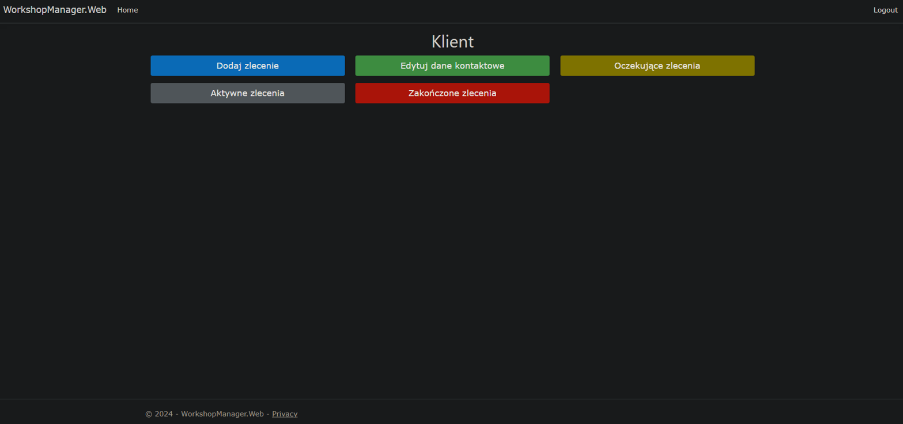
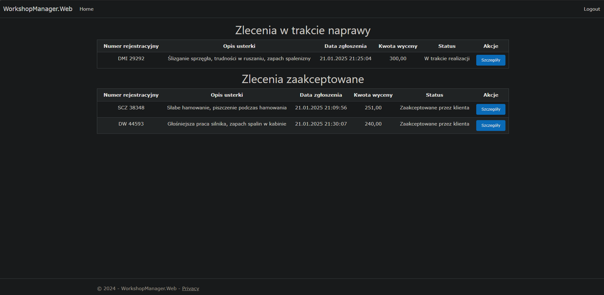
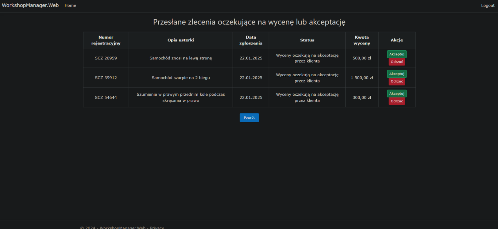
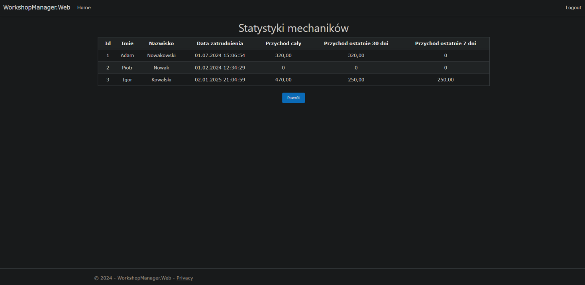

# WorkshopManager

WorkshopManager serves purpose of minimal ERP and CRM program. 

## Example screenshots

### Client - Main View

### Owner - orders(repairs) list

### Client - Accept repair estimate

### Owner - Workers stats

## Overview

Project was made in group of people where <b>i have been responsible for programming, creating tasks, managing team and general project architecture + functional requirements.</b>

Project is written in <b>C# using ASP.NET MVC framework + EF + Identity Framework</b>

## Architecture

Project consists of 5 sub-projects:

* <b>Web</b> - Controllers, Views and startup class
* <b>Model</b> - contains data models for business rules and persistance
* <b>Services</b> - Services performing actions to satisfy business rules
* <b>DAL</b> - Data Access Layer - Using EF to easily create Database schema
* <b>ViewModels</b> - ViewModels to transfer business data into Views

## Technologies

* <b>C#</b>
* <b>ASP.NET MVC</b>
* <b>EF</b>
* <b>Identity Framework</b>
* <b>HTML</b>
* <b>CSS</b>
* <b>JS</b>

## Authors

<b>PaawllooPL (ME)</b>
* https://github.com/PaawllooPL
* https://gitlab.com/PaawllooPL

Haitoke
* https://github.com/haitoke

Tomcio2002
* https://github.com/Tomcio2002

Michalecekxd
* https://github.com/Michalecekxd